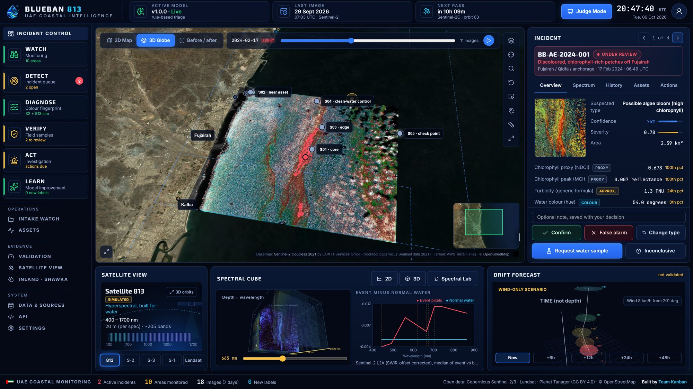
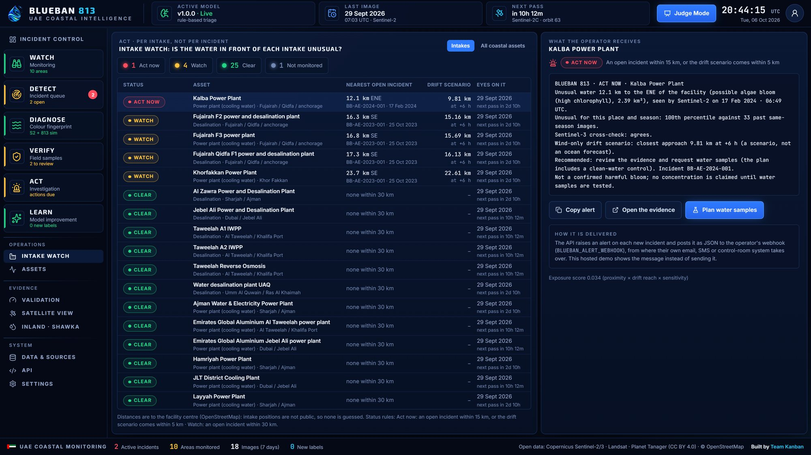
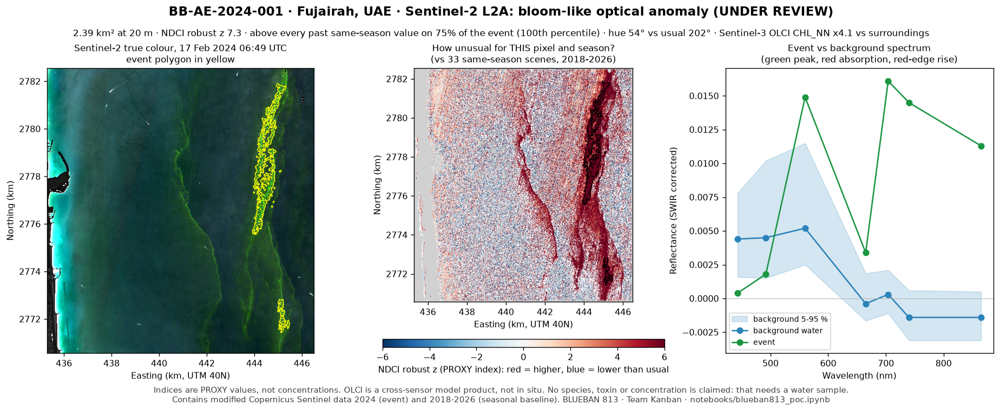
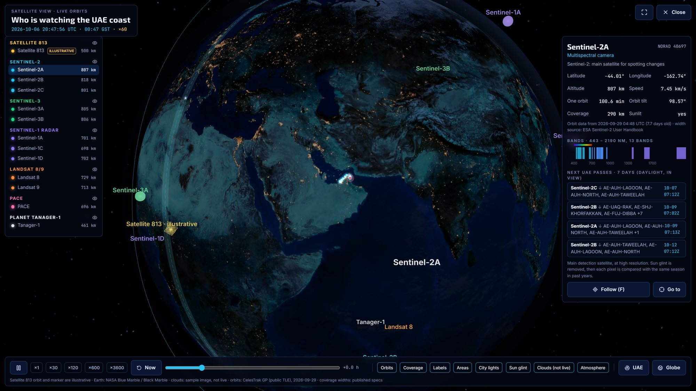

# BLUEBAN 813

**Early warning for the water in front of the UAE's intakes.** BLUEBAN 813 screens Sentinel-2 images of UAE coastal waters (and the Shawka Dam reservoir) against each pixel's own seasonal history, cross-checks them with Sentinel-3, measures what Satellite 813's hyperspectral bands would add, and turns every anomaly into a governed incident: a person reviews it, a field team samples it, and the model learns, going live only when it provably improves.

**Team Kanban** · United Arab Emirates · Arab Youth Space Hackathon 2026, 813 Challenge · Theme: **Water Quality & Inland/Coastal Water Intelligence**

[](https://colab.research.google.com/github/4waiz/BlueBan-813/blob/main/notebooks/blueban813_poc.ipynb)

| | |
|---|---|
| **Live app** | [blueban813.kanbanstudios.ae](https://BlueBan813.kanbanstudios.ae) (mirror [blueban813.pages.dev](https://blueban813.pages.dev)). Press **Judge Mode** (top right) for the guided three-minute tour |
| **Notebook** | [`notebooks/blueban813_poc.ipynb`](notebooks/blueban813_poc.ipynb): reproduces the headline result offline in under a minute |
| **Slides** | [`docs/slides.pdf`](docs/slides.pdf) |
| **Paper** | [4waiz.github.io/BlueBan-813](https://4waiz.github.io/BlueBan-813/) |



**For reviewers, where to find things**

| You are looking for | Section |
|---|---|
| Problem and intended user | [2. Business use case](#2-the-business-use-case) · [3. The problem](#3-the-problem) |
| Data sources and licences | [4. Data used](#4-data-used) |
| How to run or review it | [6. Installation](#6-installation) · [7. How to run](#7-how-to-run) |
| Visible results or a demo | [8. Example input and output](#8-example-input-and-output) · the live app |
| Methods, assumptions and limitations | [5. Technical approach](#5-technical-approach) · [9. Results and limitations](#9-results-and-limitations) |

---

## 1. Summary

> We screen UAE coastal waters and the Shawka Dam reservoir for **unusual water colour**, on every Sentinel-2 pass since 2017, so that **desalination operators and environment regulators** can decide **whether, where and what to sample** before the water reaches an intake.

Most water-quality tools stop at a coloured index map. BLUEBAN 813 treats every anomaly as an **incident** that moves through a governed loop:

```
WATCH ─► DETECT ─► DIAGNOSE ─► VERIFY ─► ACT ─► LEARN
  │         │          │           │        │       │
Sentinel-2  each pixel spectrum,   analyst  intake  verified labels ─► candidate model
L2A over    vs its own Sentinel-3  review,  watch,  ─► frozen test set ─► a named person
10 UAE      same-season cross-check,audit   field   approves (the live model is untouched
areas       history    813 (sim.)  trail    plan    until the candidate is provably better)
```

The PoC is deployed and working: review, sampling, retraining, the promotion gate and rollback run in the browser; a FastAPI backend runs the same loop on a database. Every decision is written to a SHA-256 hash-chained audit log, and every displayed number carries its provenance (**WHY AM I SEEING THIS?**).

## 2. The business use case

| User | The decision they make | What they use today |
|---|---|---|
| **Desalination and power-plant operators** | Step up pre-treatment, prepare the intake, send a boat? | Intake filters and laboratory results, after the water has arrived |
| **Environment regulators and municipalities** | Where to sample today, what to report, when to warn a beach | A fixed sampling calendar and complaints from the public |
| **Ports, fish farms, beaches** | Protect stock, pause works, close a beach | What can be seen from the shore |

What BLUEBAN 813 changes:

| Today | With BLUEBAN 813 |
|---|---|
| Boat samples on a fixed calendar | Extra sampling only where the evidence is, always with a clean-water control |
| "Is this normal?" answered from memory | Answered from years of images of that exact spot and season |
| Discolouration reported by the public | Flagged on the next clear Sentinel-2 overpass (every 2–5 days) |
| A conclusion in an email | A decision with its evidence, model version and a tamper-evident log |

For an operator the question is per intake, not per incident: the **Intake watch** screen lists each desalination plant, power-plant cooling intake and industrial intake, the nearest unusual water, the wind-only drift scenario's closest approach, and the alert the operator receives (posted as JSON to their webhook, then email, SMS or control room). Business model and pilot plan: [`docs/BUSINESS_CASE.md`](docs/BUSINESS_CASE.md).



## 3. The problem

* **The UAE drinks the sea.** Most of the country's drinking water comes from about 70 major desalination plants on its two coasts ([UAE Government portal](https://u.ae/en/information-and-services/environment-and-energy/water-and-energy/water-)).
* **Blooms close intakes.** In the 2008–09 *Cochlodinium polykrikoides* red tide in the Gulf of Oman and the Gulf, seawater reverse-osmosis plants shut for up to four months; at Fujairah the reverse-osmosis plant was shut while the thermal plant kept running ([IOC-UNESCO 2017, *Harmful Algal Blooms and Desalination*, Manuals and Guides 78](https://repository.oceanbestpractices.org/handle/11329/759)).
* **The warning comes too late.** Today it comes from the intake filters, a boat sample on a fixed calendar, or the public.

**Why satellite data is the right instrument.** Sentinel-2 images the whole UAE coast every 2–5 days at 20 m, for free; its archive since 2017 lets every pixel be compared with its own past seasons, which is what separates a new event from a permanently turbid harbour. Sentinel-3 gives an independent same-morning look. Hyperspectral sensors (Satellite 813, EnMAP, Tanager) resolve the narrow red-edge and pigment features that separate early, borderline cases from ordinary water; BLUEBAN measures that benefit rather than assuming it.

## 4. Data used

| Dataset | Provider and access | Dates | Processing level | Licence | Used for |
|---|---|---|---|---|---|
| **Sentinel-2 MSI L2A** | ESA Copernicus, via Microsoft Planetary Computer STAC (`sentinel-2-l2a`, anonymous) | 2017–2026 (Fujairah from 2017, other areas from 2021); 5,080 datatakes over 10 UAE areas | L2A bottom-of-atmosphere reflectance; each product's processing baseline sets the BOA offset; SCL masks | Copernicus: free, full and open (attribution) | Detection, the primary sensor |
| **Sentinel-3 OLCI WFR** | EUMETSAT / ESA Copernicus, via Planetary Computer (`sentinel-3-olci-wfr-l2-netcdf`) | 2017 – 2026-02-23 (end of that archive) | Level-2 water, 300 m (CHL_NN, TSM_NN, WQSF flags) | Copernicus: free, full and open | Same-morning cross-check; 436 reference labels (weight 0.5), never ground truth |
| **Planet Tanager-1** | Planet Labs open STAC (`coastal-water-bodies`), scene `20250601_104901_58_4001` | 2025-06-01 (Gulf of Annaba) | Ortho surface reflectance, >420 bands, 35 m | CC BY 4.0 | Real pixels convolved to the Satellite 813 band set (simulation) and the 813 test |
| **EnMAP HSI L2A** | DLR EOC Geoservice | 2022-09-08, 2024-04-24 (Shawka Dam) | L2A surface reflectance, ~224 bands, 30 m | EnMAP data licence; redistribution of the imagery not confirmed, so only derived masks and scores are published | Inland: where the water is, anomalies, 813 simulated on EnMAP |
| **Landsat 8/9 C2 L2** + Sentinel-2 | USGS and ESA, via Planetary Computer | Sep 2023 – Oct 2025 | L2 surface reflectance | Public domain (USGS); Copernicus open | Inland baseline (28 observations) |
| **ERA5 hourly 10 m wind** | ECMWF / Copernicus C3S, via the Open-Meteo archive API | Per event | Reanalysis | Copernicus licence (attribution) | Wind-only drift scenario |
| **ESA WorldCover 2021** | ESA, via Planetary Computer (`esa-worldcover`) | 2021 | 10 m land cover | CC BY 4.0 | Land and near-shore zones in WATCH |
| **OpenStreetMap** | OpenStreetMap contributors (Overpass extract) | 2026 | Vector | ODbL | 120 coastal assets: 8 desalination and 22 power plants, ports, beaches |
| **EAD marine monitoring locations** | Abu Dhabi Spatial Data Infrastructure | 2026 | Vector (locations only; measurements are not public) | ADSDI open data | Map context |
| **Satellite 813** | Arab Youth Space Hackathon / partners | n/a | n/a | n/a | **Not available to teams in the PoC phase.** Its published band set (~205 bands, 400–1700 nm, 20 m) is simulated from real Tanager and EnMAP pixels and labelled SIMULATED everywhere |

Display only, never analysed: EOX Sentinel-2 cloudless 2021 basemap (CC BY-NC-SA 4.0), AWS Terrain Tiles, NASA Blue Marble / Black Marble, CelesTrak orbital elements. No UAE in-situ chlorophyll, turbidity or TSS data are public, so none are used. Full lineage: [`docs/DATA_LINEAGE.md`](docs/DATA_LINEAGE.md); in-app: **Data & sources**.

## 5. Technical approach

In execution order (code in `pipeline/` and `scripts/`, parameters as run):

1. **WATCH: read correctly** (`pipeline/watch.py`, `pipeline/s2_features.py`). Sentinel-2 L2A per datatake on each area's grid, 120 m for screening and 20 m for incidents; the BOA offset follows each product's processing baseline (−1000 DN from baseline 04.00); SCL cloud, shadow and defective-pixel masks; a glint-aware water mask with a shoreline buffer.
2. **Water-quality features** (`pipeline/s2_features.py`). NDCI, MCI red-edge peak, FAI, hue angle, CDOM ratio and Nechad (2016) turbidity. Each carries a `quantity_kind`: `PROXY` or `GENERIC_CALIBRATION`. No concentration is printed unless a feature is `CALIBRATED` against local water samples.
3. **DETECT: each pixel against its own past** (`pipeline/detect.py`, `scripts/build_incidents.py`). For every pixel, a climatology of the same feature from acquisitions within ±45 days of day-of-year in other years; robust z = (x − median) / (1.4826·MAD + floor) and the seasonal percentile. An event is a connected water region with z ≥ 3 and ≥ 95th percentile, at least 0.5 km². Persistent features sit inside their own history and are ignored.
4. **DIAGNOSE** (`pipeline/sentinel3.py`, `pipeline/spectral.py`, `pipeline/satellite813.py`). Event vs background spectrum; Sentinel-3 OLCI CHL_NN / TSM_NN the same morning as an independent reference; the 813 band set simulated by Gaussian spectral-response convolution of real hyperspectral pixels.
5. **ACT** (`pipeline/exposure.py`, `pipeline/forecast.py`, `pipeline/sampling.py`, `pipeline/incidents.py`). Distance and exposure to each registered asset, a wind-only drift scenario (3 % of the ERA5 10 m wind plus spreading), a sampling plan (core, edge, near asset, uncertainty and a mandatory clean-water control), alerts.
6. **LEARN** (`pipeline/learning.py`, `services/api/trainer.py`, `apps/web/lib/learning.ts`). Verified labels (analyst 1.0, field 2.0, Sentinel-3 reference 0.5) train an L2-regularised, class-balanced logistic candidate on the train split. The frozen validation split is grouped by area and month, so near-duplicates cannot leak across it. The gate checks: model tests pass, the validation set is unchanged (hash), both classes are present, AUPRC is not worse (grouped bootstrap), calibration is acceptable, no area regresses, and **a named person approves**. Nothing is promoted automatically, and the previous model can be restored in one click.
7. **What 813 adds** (`experiments/detectability_ablation.py`). On the same real Tanager pixels, the same classifier with Sentinel-2 bands vs the simulated 813 bands, evaluated with spatially blocked cross-validation (1.2 km blocks).

Methodology in depth: [`docs/METHODOLOGY.md`](docs/METHODOLOGY.md).

## 6. Installation

Requires **Python 3.11 or 3.12** (Google Colab works too). Every pin in `requirements.txt` has wheels for Linux, Windows and macOS, so nothing is compiled.

```bash
git clone https://github.com/4waiz/BlueBan-813.git
cd BlueBan-813
python -m venv .venv && source .venv/bin/activate      # Windows: .venv\Scripts\activate
pip install -r requirements.txt
```

No API keys or accounts are needed: everything the notebook reads is committed, and the scripts use anonymous Planetary Computer access. `.env.example` lists optional variables (a Planetary Computer key for higher rate limits, an alert webhook); none is required.

## 7. How to run

**The notebook (the reproducible PoC):**

```bash
jupyter lab notebooks/blueban813_poc.ipynb
```

Run all cells. It runs offline on a laptop CPU in about 30–50 seconds, reads `data/sample_input/` and committed `outputs/`, and writes the figures and tables in `results/`. Nothing needs editing. To run it without opening Jupyter:

```bash
jupyter nbconvert --to notebook --execute --inplace notebooks/blueban813_poc.ipynb
```

At the end you see the Fujairah event mapped and measured against its own past, the Sentinel-3 cross-check, the simulated 813 comparison, the learning gate stopping at "awaiting named human approval", and a table comparing every computed number with the published one.

**Tests** (pipeline, closed loop, API contracts, matchups; 142 tests, about 2 minutes):

```bash
python -m pytest -q
```

**Regenerate the sample input from the archive** (anonymous Planetary Computer access, about 3 minutes):

```bash
python scripts/fetch_sample_input.py
```

**The app.** Hosted, nothing to install: [blueban813.kanbanstudios.ae](https://BlueBan813.kanbanstudios.ae). Locally (Node 20+):

```bash
python scripts/build_static_site.py          # copy the pipeline outputs into the web app
cd apps/web && npm ci && npm run dev          # http://localhost:3000
```

With the API instead of the in-browser workspace (FastAPI + SQLite; `DATABASE_URL` for PostgreSQL):

```bash
python scripts/seed_db.py --reset
uvicorn services.api.main:app --port 8813
cd apps/web && NEXT_PUBLIC_DATA_MODE=live npm run dev
```

**Rebuild the evidence from the public archive** (network; long-running steps noted):

```bash
python scripts/build_watch.py --aoi AE-FUJ --res 120 --start 2017-01-01 --cache   # per-datatake stats + feature cache (resumable)
python scripts/build_detect.py --aoi AE-FUJ                                      # per-pixel seasonal anomaly
python scripts/build_labels.py --aoi AE-FUJ                                      # Sentinel-3 cross-sensor references
python scripts/build_incidents.py --aoi AE-FUJ --date 2024-02-17 --hyp BLOOM_LIKE --keep all --id BB-AE-2024-001
python scripts/build_workspace_seed.py && python scripts/build_validation.py && python scripts/fetch_tle.py
```

## 8. Example input and output

**Input** ([`data/sample_input/`](data/sample_input/README.md), 8.7 MB): the Sentinel-2A L2A event image of 17 February 2024 06:49 UTC (item `S2A_MSIL2A_20240217T064941_R020_T40RDN_20240217T105525`) clipped to a 12 × 11 km window off Fujairah at 20 m, and the per-pixel same-season baseline from 36 acquisitions of 2018–2026, on the same grid. `manifest.json` lists every STAC item, the grid, checksums and the regeneration command.

**Output** ([`results/`](results/)), produced by the notebook:



| File | What it shows |
|---|---|
| `results/example_output.png` | The figure above |
| `results/01_true_colour.png` … `06_learning_gate.png` | One figure per step: image, features, anomaly polygon, a pixel's history, spectra, 813 simulation, learning gate |
| `results/event_polygon.geojson` | The detected event (EPSG:4326) |
| `results/incident_summary.json` | Every computed number |
| `results/computed_vs_published.csv` | The notebook's numbers next to the published ones (all reproduced) |

## 9. Results and limitations

**The UAE case: BB-AE-2024-001, Fujairah, 17 February 2024, 06:49 UTC (Sentinel-2A)**

| Evidence | Value |
|---|---|
| What Sentinel-2 saw | Bright-green filaments of discoloured water off Fujairah (median 8 km from the coast), 2.39 km² at 20 m |
| Against the same pixels' own history | NDCI robust z = 7.3 (100th seasonal percentile vs 33 same-season scenes from other years); MCI red-edge peak 0.0068 vs 0.0007 usual |
| Colour change | Hue angle 54° where this water is usually 202° blue: visible discolouration |
| Independent sensor, same morning | Sentinel-3B OLCI 30 min earlier: CHL_NN **13.1 vs 3.2 mg m⁻³** in the surrounding water (×4.1). A model product, not in-situ truth |
| Context (not confirmation) | Green *Noctiluca* season in the Gulf of Oman (Nov–Apr); NASA PACE imaged a likely-*Noctiluca* bloom in the Gulf of Oman on 17 Mar 2024 |
| Status | **UNDER REVIEW**: "bloom-like optical anomaly". No species, no toxin, no concentration is claimed: that needs a water sample |

**It stands down when it should:** BB-AE-2023-001 (Fujairah, 25 Oct 2023) is a large NDCI spike over water whose colour did not change (hue 221°, blue) and where same-morning OLCI saw nothing unusual (×1.1): an analyst should reject it, and that rejection becomes a training label. BB-DZ-2025-001 (Gulf of Annaba, the negative control) is spatially unusual (RX 99.7th percentile) but at the 6.6th seasonal percentile of 428 observations: a persistent coastal feature, stood down automatically.

**The learning loop, on held-back data:** on the frozen validation set (100 labels, grouped by area and month) the learned candidate reaches **AUPRC 0.94 vs 0.66** for the rule; the grouped bootstrap 95 % interval on the gain is [0.04, 0.48], and the candidate beats the rule on **9 of 9** held-out areas. It still waits for a named person's approval.

**What Satellite 813 adds, measured on the same real Tanager pixels** (25,513 pixels, 173 spatial blocks, 1.2 km):

* At the operational decision boundary the simulated 813 band set cut false alarms from **159 to 84 (−47 %)** at the same recall (0.999); F1 0.985 → 0.992.
* For a gross plume both saturate: **no gain**.
* Concentration vs OLCI products: **not demonstrated** (CHL_NN R² 0.08 for Sentinel-2, 0.01 for 813, on 658 matchups 25.5 h apart): underpowered, reported anyway.

The reference is a full-spectrum (368-band) anomaly detector, not field data. Details: [`docs/VALIDATION_REPORT.md`](docs/VALIDATION_REPORT.md) and the in-app **Validation** screen (sections A–F).

**What is real, and what is not**

| | Status |
|---|---|
| Sentinel-2 L2A (primary sensor) | **Real.** 2017–2026 archive via Microsoft Planetary Computer, baseline-aware `BOA_ADD_OFFSET`, SCL masks, glint-aware water mask |
| Sentinel-3 OLCI WFR | **Real, used as a cross-sensor reference** (weight 0.5 labels, evidence), never called ground truth. Planetary Computer archive ends 2026-02-23 |
| Satellite 813 | **Simulated.** No 813 product is accessible to teams (authenticated audit, 30 Sep 2026). The 813 band set is simulated from real Planet Tanager-1 and EnMAP pixels and labelled SIMULATED everywhere |
| UAE in-situ chlorophyll / turbidity / TSS | **None public.** So no physical concentration is ever printed: indices are PROXY; turbidity is a GENERIC calibration (Nechad 2016) marked "not locally validated". The matchup engine and calibration gate are built and wait for samples |
| Drift | A wind-only **SCENARIO TRAJECTORY ESTIMATE** (ERA5), not a hydrodynamic forecast |

**Where it breaks.** Bloom-like flags agree weakly with Sentinel-3 (Spearman ρ −0.19, n = 83; sediment-like 0.46, n = 353). Labels are dominated by sediment-like candidates in shallow Gulf water. Intake positions are not public, so distances are to facility centres. The EOX basemap is non-commercial and would be replaced in a product. All of it, with what would change the conclusions: [`docs/LIMITATIONS.md`](docs/LIMITATIONS.md).

## 10. Team, licence and attribution

**Team Kanban** (United Arab Emirates): **Awaiz Ahmed** (team lead), **Mohammad Umar**, **Huda Mueen**, **Bilal Feroz**. Together the team covers Earth-observation processing, machine learning and validation, full-stack web, 3D and API development, and product.

**Licence.** Code: [MIT](LICENSE). Data keep their own licences (section 4).

**Attribution.** Contains modified Copernicus Sentinel data 2017–2026, processed by ESA and EUMETSAT, accessed via Microsoft Planetary Computer. Planet Tanager-1 open data © Planet Labs PBC, CC BY 4.0. EnMAP data © DLR. Landsat courtesy of the U.S. Geological Survey. ERA5 hourly data from the Copernicus Climate Change Service, via Open-Meteo. ESA WorldCover 2021 (CC BY 4.0). Map data © OpenStreetMap contributors (ODbL). Basemap: Sentinel-2 cloudless 2021 by EOX IT Services GmbH (CC BY-NC-SA 4.0). Earth textures: NASA Blue Marble / Black Marble. Orbits: CelesTrak. Thanks to the UAE Space Agency, the National Space Academy and Space42 for the 813 Challenge.

---

## Product screens

| Screen | Task it serves |
|---|---|
| **Incident Control** | One screen: the event mapped, its evidence, the decision buttons, the spectral cube and the drift scenario |
| **Intake watch** | Per intake: status, nearest unusual water, drift scenario, the operator's alert |
| **Investigation** | Timeline, before/after map, evidence stack, report and evidence-package export, close/reopen |
| **Spectral Lab** | 2D spectrum with diagnostic bands, 3D spectral cube, "What did 813 add?" |
| **Field Ops** | Editable sample plan, collection states, measurement entry, lab CSV, CSV/GeoJSON export |
| **Learn** | Labels, train candidate, compare, promote / reject / rollback, tamper check of the audit log |
| **Validation** | A data quality · B matchups · C model performance · D 813 ablation · E spatial holdout · F negative control |
| **Satellite View** (full screen, 3D) | Real Earth lit by the real Sun; Sentinel-1/2/3, Landsat 8/9, PACE and Tanager-1 propagated with SGP4 from public TLEs; published swaths; predicted UAE passes; Satellite 813 on an explicitly illustrative orbit |
| **Judge Mode** | Why it matters, the closed loop and who it is for, in 13 steps (about 3 minutes), with real review / retrain / promote actions |
| **Data · Assets · API · Settings** | Source register and licences, lineage, audit log, docs; asset register; HTTP contract; operator identity, workspace export/reset, alert webhook |



## Repository

```
notebooks/       blueban813_poc.ipynb: the reproducible PoC (runs offline)
data/            sample_input/ (committed example input), inland/ (Shawka Dam derived products)
results/         example output written by the notebook
pipeline/        s2_features, watch, detect, sentinel3, satellite813, matchup, quantify,
                 learning, incidents, exposure, forecast, sampling, report; inland/
services/api/    FastAPI router, SQLite store (hash-chained audit), trainer (retrain, gate, promote, rollback)
scripts/         fetch_sample_input, build_watch / detect / labels / incidents / validation / static_site, seed_db
apps/web/        Next.js 15, MapLibre, React Three Fiber; one Engine interface (HTTP or in-browser workspace)
outputs/         pipeline outputs the app and the notebook read (incidents, validation, watch series, labels)
config/          UAE areas, OSM asset register, EAD station locations, TLE snapshot
docs/            slides.pdf, methodology, validation, limitations, data lineage, business case, judging matrix
paper/           research paper (published with GitHub Pages)
tests/           pytest suite + TypeScript/Python learning parity
```

## Documentation

[Methodology](docs/METHODOLOGY.md) · [Validation report](docs/VALIDATION_REPORT.md) · [Limitations](docs/LIMITATIONS.md) · [Data lineage](docs/DATA_LINEAGE.md) · [Business case](docs/BUSINESS_CASE.md) · [Judging matrix](docs/JUDGING_MATRIX.md) · [813 product notes](docs/813_PRODUCT_NOTES.md) · [Authenticated data audit](docs/AUTHENTICATED_DATA_AUDIT.md) · [Public UAE data](docs/PUBLIC_UAE_DATA.md) · [UAE event register](docs/UAE_EVENT_REGISTER.md) · [UAE AOI tournament](docs/UAE_AOI_TOURNAMENT.md) · [Mentor revamp audit](docs/MENTOR_REVAMP_AUDIT.md) · [Roadmap](docs/ROADMAP.md)

## Principles

* **Hypotheses, not verdicts.** "Bloom-like", never "HAB confirmed" without species and field evidence; never "oil" from a SAR dark spot; never "source" from a trajectory.
* **No invented data.** Simulated 813 is labelled simulated. Sentinel-3 model products are references, not ground truth. No concentration from an uncalibrated index.
* **Measure the claim.** Every model number is on a frozen, grouped validation split; the 813 benefit is an ablation, not an assumption.
* **Humans promote models.** The previous production model stays untouched until a candidate passes the gate and a named person approves.

Restricted or authenticated downloads never leave `data/raw/private/` (gitignored). Everything in this repository is derived from open data.

## Inland complement: Shawka Dam (appended 2026-10-02)

The challenge covers inland water as well as coasts. A second module, built
separately, covers **Shawka Dam (Ras Al Khaimah)**, a small wadi reservoir, from
two fixed **EnMAP L2A hyperspectral** dates (2022-09-08, 2024-04-24) and a
28-observation Sentinel-2/Landsat baseline (September 2023 to October 2025). It is
integrated as a pure add-on: the coastal pipeline, outputs and numbers are unchanged.

* **What it shows.** A 10-pixel (30 m) persistent wet core inside the locked polygon
  (84 px), dark on both dates; a two-year deviation detector whose clearest signal
  is a Sep–Oct 2025 cluster on both sensors as the pool nearly dried; an RX anomaly
  and fingerprint layer on the core; and Satellite 813 simulated on a second
  hyperspectral sensor (196 of 205 simulated 813 bands have real EnMAP support).
* **Where.** `/inland` in the app (3D wet-core map, EnMAP→813 band ladder,
  deviation ribbon), `GET /api/inland/summary`, [`docs/inland/`](docs/inland/README.md),
  `pipeline/inland/`, `data/inland/`, `config/project.yaml` → `sites.shawka_dam`.
* **Static results, not a live feed.** The inland pipeline code is kept for
  methodology transparency and future scenes; BLUEBAN serves its precomputed outputs.
* **Reviewed on integration.** [`docs/inland/REVIEW_FLAGS.md`](docs/inland/REVIEW_FLAGS.md) lists what looks
  off, with evidence (flagged, not fixed). The two high-severity flags are the
  licence and a band table that matches the 2024 scene only.

Two caveats, carried over exactly:

* EnMAP's license is "proprietary" with redistribution terms not yet confirmed for public submission.
* Detector caveat: the anomaly/fingerprint results are based on a ~10-17 pixel background population, not a calibrated detector.

Per-pixel EnMAP reflectance layers and spectra therefore stay in
`data/inland/restricted/` (gitignored) until the licence is confirmed; the
public summary carries derived masks, scores and counts only.
