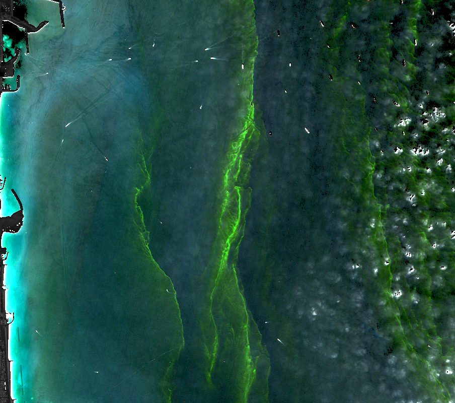

# BLUEBAN 813

**Closed-loop coastal incident intelligence for the UAE.**
Satellites flag it. An analyst decides. The field confirms. The model learns — and only gets promoted when it provably improves.

> Arab Youth Space Hackathon 2026 · 813 Challenge (Water Quality) · [Built by Team Kanban](https://kanbanstudios.ae/team-kanban)
>
> **Live:** [BlueBan813.kanbanstudios.ae](https://BlueBan813.kanbanstudios.ae) · **Paper:** [4waiz.github.io/BlueBan-813](https://4waiz.github.io/BlueBan-813/) · **Judge Mode:** one click, top right of the app

---

## What it does

Most water-quality dashboards stop at a coloured index map. BLUEBAN 813 treats every anomaly as an **incident** that moves through a governed loop:

```
WATCH ─► DETECT ─► DIAGNOSE ─► VERIFY ─► ACT ─► LEARN
  │         │          │           │        │       │
Sentinel-2  per-pixel  spectrum,   analyst  field   verified labels ─► candidate model
L2A over    seasonal   OLCI cross- review,  plan,   ─► frozen validation gate ─► human
10 UAE AOIs anomaly    check, 813  audit    lab     promotion (production untouched
            vs its own ablation    trail    results until the candidate is better)
            history
```

Every decision is written to a SHA-256 hash-chained audit log. Every displayed number carries its provenance (**WHY AM I SEEING THIS?**).

## The UAE case (real data)

**BB-AE-2024-001 · Fujairah, 17 February 2024, 06:49 UTC (Sentinel-2B)**



| Evidence | Value |
|---|---|
| What Sentinel-2 saw | Bright-green filaments of discoloured water off Fujairah (median 8 km from the coast), 2.39 km² at 20 m |
| Against the same pixels' own history | NDCI robust z = 7.3 (100th seasonal percentile vs 33 same-season scenes from other years); MCI red-edge peak 0.0068 vs 0.0007 usual |
| Colour change | Hue angle 54° where this water is usually 202° blue: visible discolouration |
| Independent sensor, same morning | Sentinel-3B OLCI 30 min earlier: CHL_NN **13.1 vs 3.2 mg m⁻³** in the surrounding water (×4.1). A model product, not in-situ truth |
| Context (not confirmation) | Green *Noctiluca* season in the Gulf of Oman (Nov–Apr); NASA PACE imaged a likely-*Noctiluca* bloom in the Gulf of Oman on 17 Mar 2024 |
| Status | **UNDER REVIEW** — "bloom-like optical anomaly". No species, no toxin, no concentration is claimed: that needs a water sample |

**Two stand-downs show it does not cry wolf:**

* **BB-AE-2023-001 · Fujairah, 25 Oct 2023** — a large NDCI spike over water whose colour did not change (hue 221°, blue) and where same-morning OLCI saw nothing unusual (×1.1). The NDCI ratio blows up over very clear water; an analyst should reject it, and that rejection becomes a training label.
* **BB-DZ-2025-001 · Gulf of Annaba (negative control)** — spatially unusual (RX 99.7th percentile) but at the 6.6th seasonal percentile of 428 observations: a persistent coastal feature. Stood down automatically.

## What is real, and what is not

| | Status |
|---|---|
| Sentinel-2 L2A (primary sensor) | **Real.** 2017–2026 archive via Microsoft Planetary Computer, baseline-aware `BOA_ADD_OFFSET`, SCL masks, glint-aware water mask |
| Sentinel-3 OLCI WFR | **Real, used as a cross-sensor reference** (weight 0.5 labels, evidence) — never called ground truth. Planetary Computer archive ends 2026-02-23 |
| Satellite 813 | **Simulated.** No 813 product is accessible to teams (authenticated audit, 30 Sep 2026). The 813 band set is simulated from real Planet Tanager-1 hyperspectral pixels and labelled SIMULATED everywhere |
| UAE in-situ chlorophyll / turbidity / TSS | **None public.** So no physical concentration is ever printed: indices are PROXY; turbidity is a GENERIC calibration (Nechad 2016) marked "not locally validated". The matchup engine and calibration gate are built and wait for samples |
| Drift | A wind-only **SCENARIO TRAJECTORY ESTIMATE** (ERA5), not a hydrodynamic forecast |

## Measured, not assumed: what did 813 add?

On the same real Tanager pixels (Gulf of Annaba), convolved to Sentinel-2 and to the published 813 band set, with spatially blocked cross-validation:

* **At the operational decision boundary** the simulated 813 band set cut false alarms from **159 to 84 (−47 %)** at the same recall (0.999), F1 0.985 → 0.992, over 25,513 pixels in 173 spatial blocks.
* **For a gross plume**, both saturate: no gain.
* **Concentration vs OLCI products**: not demonstrated. CHL_NN R² 0.08 (S2) and 0.01 (813) on 658 matchups taken 25.5 h apart: underpowered, reported anyway.

Details: [`docs/VALIDATION_REPORT.md`](docs/VALIDATION_REPORT.md) and the in-app **Validation** screen (sections A–F).

## The learning loop

1. The **production** triage model (a transparent rule, `triage-1.0.0`) ranks candidates.
2. Analysts **CONFIRM / FALSE POSITIVE / RECLASSIFY** → verified labels (analyst 1.0, field 2.0, OLCI cross-sensor 0.5).
3. **Retrain** fits an L2 logistic candidate on the train split (identical in Python and in the browser — parity-tested to 1e-7).
4. The **gate**: tests pass · frozen validation set unchanged (hash) · both classes present · AUPRC not worse (grouped bootstrap) · calibration acceptable · no AOI regression · **a named human approves**.
5. Promotion retires the old model (rollback in one click). Nothing is ever promoted automatically.

## Product

| Screen | Task it serves |
|---|---|
| **Incident Control** | Monitor AOIs, create AOIs (draw → live STAC query), open incidents, alerts |
| **Investigation** | Timeline, before/after split map, evidence stack, report and evidence-package export, close/reopen |
| **Spectral Lab** | 2D spectrum with diagnostic bands, 3D spectral cube, "What did 813 add?" |
| **Field Ops** | Editable sample plan, collection states, measurement entry, lab CSV, CSV/GeoJSON export |
| **Learn** | Labels, train candidate, compare, promote / reject / rollback |
| **Validation** | A data quality · B matchups · C model performance · D 813 ablation · E spatial holdout · F negative control |
| **Satellite View** (full screen, 3D) | Real Earth (NASA Blue Marble / Black Marble) lit by the real Sun; Sentinel-1/2/3, Landsat 8/9, PACE and Tanager-1 propagated with SGP4 from public TLEs; published swaths; predicted UAE passes; Satellite 813 on an explicitly illustrative orbit |
| **Judge Mode** | The whole story in 11 steps, 2–3 minutes, with real review / retrain / promote actions |
| **Data · Settings · API** | Source register and licences, lineage, audit log, docs; operator identity, workspace export/reset, alert webhook; HTTP contract |

## Run it

```bash
pip install -e ".[dev]"                 # Python 3.11+
python -m pytest -q                     # pipeline, closed loop, API contracts, matchups
```

Rebuild the evidence from public data (network; long-running steps noted):

```bash
python scripts/build_watch.py --aoi AE-FUJ --res 120 --start 2017-01-01 --cache   # per-datatake stats + feature cache (resumable)
python scripts/build_detect.py --aoi AE-FUJ                                      # per-pixel seasonal anomaly
python scripts/build_labels.py --aoi AE-FUJ                                      # OLCI cross-sensor references
python scripts/build_incidents.py --aoi AE-FUJ --date 2024-02-17 --hyp BLOOM_LIKE --keep all --id BB-AE-2024-001
python scripts/build_workspace_seed.py && python scripts/build_validation.py && python scripts/fetch_tle.py
```

Self-hosted (FastAPI + SQLite; `DATABASE_URL` for PostgreSQL):

```bash
python scripts/seed_db.py --reset
uvicorn services.api.main:app --port 8813
cd apps/web && npm install && NEXT_PUBLIC_DATA_MODE=live npm run dev
```

Hosted build (static; every visitor gets a private in-browser workspace seeded from the same `seed.json`):

```bash
python scripts/build_static_site.py
cd apps/web && npm run build            # -> apps/web/out
```

## Repository

```
pipeline/        s2_features (indices, masks), watch, detect, sentinel3, matchup, quantify,
                 learning (triage features, gate), incidents (state machine, alerts), exposure, forecast, report
services/api/    FastAPI router, SQLite store (hash-chained audit), trainer (retrain, gate, promote, rollback)
scripts/         build_watch / detect / labels / incidents / workspace_seed / validation / static_site, seed_db, fetch_tle
apps/web/        Next.js 15, MapLibre, React Three Fiber; Engine interface (HTTP or in-browser workspace)
config/          UAE AOIs, OSM asset register, EAD station locations, TLE snapshot
docs/            audits, event register, AOI tournament, methodology, validation, limitations, roadmap
paper/           research paper (published with GitHub Pages)
tests/           pytest suite + TS/Python learning parity
```

## Documentation

[Mentor revamp audit](docs/MENTOR_REVAMP_AUDIT.md) · [Authenticated data audit](docs/AUTHENTICATED_DATA_AUDIT.md) · [Public UAE data](docs/PUBLIC_UAE_DATA.md) · [UAE event register](docs/UAE_EVENT_REGISTER.md) · [UAE AOI tournament](docs/UAE_AOI_TOURNAMENT.md) · [Methodology](docs/METHODOLOGY.md) · [Validation report](docs/VALIDATION_REPORT.md) · [Limitations](docs/LIMITATIONS.md) · [Data lineage](docs/DATA_LINEAGE.md) · [813 product notes](docs/813_PRODUCT_NOTES.md) · [Business case](docs/BUSINESS_CASE.md) · [Judging matrix](docs/JUDGING_MATRIX.md) · [Roadmap](docs/ROADMAP.md)

## Principles

* **Hypotheses, not verdicts.** "Bloom-like", never "HAB confirmed" without species and field evidence; never "oil" from a SAR dark spot; never "source" from a trajectory.
* **No invented data.** Simulated 813 is labelled simulated. Sentinel-3 model products are references, not ground truth. No concentration from an uncalibrated index.
* **Measure the claim.** Every model number is on a frozen, grouped validation split; the 813 benefit is an ablation, not an assumption.
* **Humans promote models.** The previous production model stays untouched until a candidate passes the gate and a named person approves.

Restricted or authenticated downloads never leave `data/raw/private/` (gitignored). Everything in this repository is derived from open data.
